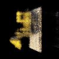
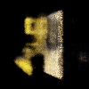
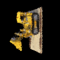
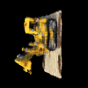

# PyTorch Implementation of Tiny NeRF

> 使用 python 中 PyTorch 库实现 NeRF，并进行两个消融实验和光线训练优化


## 1. 项目概述
本项目基于 PyTorch 实现了 Tiny NeRF，通过**体渲染 (Volume Rendering)** 技术和 **MLP 神经网络**，从一组稀疏的 2D 图像中重建 3D 场景。

核心特性：
*   坐标转换: 实现了完整的从 3D 空间点采样到 2D 像素颜色的可微渲染管线。
*   信息编码: 将低维坐标映射到高维空间，以捕获高频几何细节。
*   基于光线训练的优化: 支持基于光线 (Rays) 而非整图的批处理训练，显著降低显存占用并加速收敛。

## 2. 渲染结果

### 360° Novel View Synthesis (新视角合成)
训练 3000 iterations 后的最终渲染效果：

<div align="center">
  
  <p><i>Figure 1: 360° Rotation of Lego Bulldozer</i></p>
</div>

## 3. Ablation Studies 消融实验
为了验证网络深度与采样策略对渲染质量的影响，进行了以下对比实验。

### 3.1 调整信息编码的维度 ($D$)
探究 MLP 的深度（层数）对场景细节拟合能力的影响。

| Depth ($D$) | Rendered Result | Analysis |
| :---: | :---: | :--- |
| **D = 10** (Baseline) |  | 模型具有足够的容量 (Capacity)，能够清晰拟合挖掘机的纹理和几何边缘。 |
| **D = 5** |  | 欠拟合。由于参数量减少，网络无法存储高频信息，导致物体表面变得模糊，细节丢失。 |

### 3.2 分层采样
探究光线步进 (Ray Marching) 过程中的随机扰动 (Perturbation) 对抗锯齿的作用。

| Strategy | Rendered Result | Analysis |
| :---: | :---: | :--- |
| **With Perturbation** |  | 采样点在区间内随机抖动，本质上进行了蒙特卡洛积分 (Monte Carlo Integration)，将走样噪声转化为高频噪声，视觉更平滑。 |
| **No Perturbation** |  | 产生走样。出现了明显的环状条纹 (Banding Artifacts)，这是由于固定步长采样导致离散化误差在空间中呈现规律性分布。 |

## 4. 光线批处理优化

### 4.1 描述
为了突破显存限制并提高训练稳定性，在原有代码上重构了数据加载管线，将原始的“基于图像”采样修改为“基于光线”的采样策略。

| 训练策略 | 产生结果 | 分析 |
| :--- | :--- | :--- |
| **Image-based** (Original) |  | ❌ **High Variance (高方差)**：单张图片内的像素在空间上高度相关，导致梯度估计有偏差，收敛震荡。<br>❌ **VRAM Bottleneck**: 难以直接训练 4K 等高分辨率图像。 |
| **Ray-based** (Ours) |  | ✅ **Stable Convergence (收敛稳定)**：随机采样提供了更接近真实分布的无偏梯度估计。<br>✅ **Memory Efficient**: 显存占用仅与 Batch Size 有关，与图像分辨率解耦，支持在大场景下的精细训练。 |

### 4.2 最终结果

<div align="center">
  
  <p><i>Figure 2: Final Result</i></p>
</div>

## 4. Environment & Usage (环境与运行)
*   **Hardware**: NVIDIA RTX 5060 Laptop GPU
*   **Software**: Windows 11, PyTorch Nightly (CUDA 13.0)

### How to Run
```bash

# Clone the repository
git clone [your-repo-link]

# Install dependencies
pip install -r requirements.txt

# Run training
python run_nerf.py

## 5. Acknowledgement
*   Thanks to **Prof. Lingqi Yan** for the inspiring GAMES101 course.
*   Original Paper: *NeRF: Representing Scenes as Neural Radiance Fields for View Synthesis* (ECCV 2020).